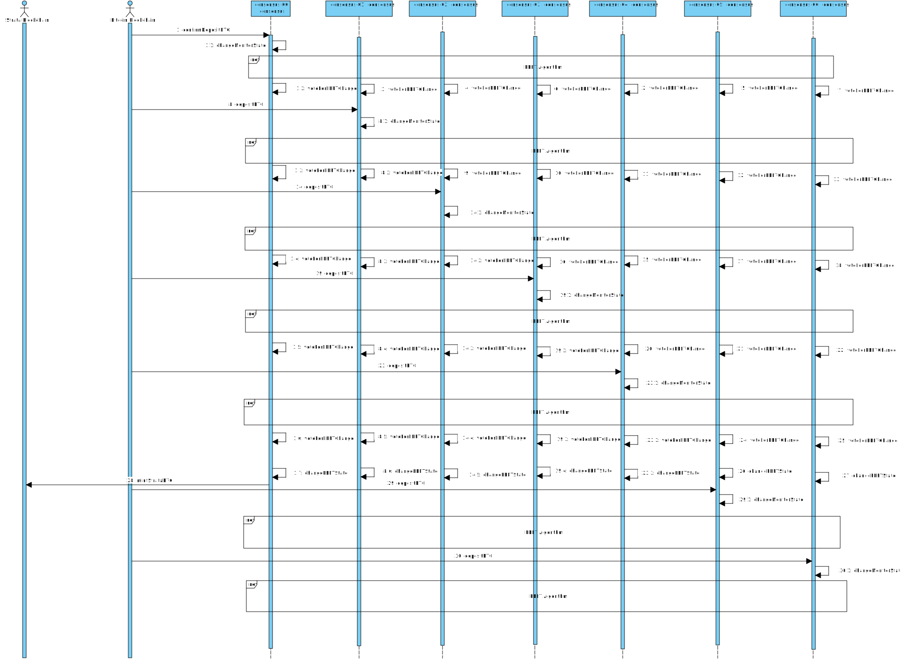

# Change PBFT State Sequence Diagram

## Sequence Diagram

 

This diagram illustrates how a change of state in the global state machine in the 
system is achieved. 

Once a session is created, the process is completely driven by the blockchains.
Each PBFT replica monitors the state of the blockchain and tracks it using the 
[monitor state machine](./state-machine.md). 

The monitor state machine closely tracks each session in the blockchains and each
monitor state machine in each replica are independent of each other. Since we
know that eventually each blockchain will converge to the same state given enough time,
we only transition to the global state machine when a _all_ non faulty replicas
have reached the same state after a confirmation period. The global state machine
only has three states: `WaitingForBTC`, `MintingTBTC`, and `ClaiminBTC`. The
global state machine starts a state `WaitingForBTC` (do not confuse with the PBFT Request State Machine). When
we all non faulty replicas have seen a confirmed transaction depositing the BTC,
then it moves to the `MintingTBTC` state. When all non faulty replicas have seen
a confirmed transaction redeeming the TBTC, then it moves to the `ClaimingBTC`,
and finally when all non faulty replicas have seen a confirmed transaction
claiming the BTC, then it moves back to the final state.

For example, in the diagram, we have that `f = 2` and the number of replicas is `7`.
Hence, we need at least `5` replicas to agree on a change of state in the global state machine. Each replica, upon seeing a confirmed transaction, will first update
its local monitor and start the PBFT process. Once the PBFT process is done, each
replica will vote toc change the state of the global state machine. Once `5` replicas
have voted, all replicas will update their global state machine to the new state. 
Once each replica has updated its global state machine, primary will start
any operation needed on the blockchain. 

In our example, we have that primary is `consensus-00` and it is initially
`WaitingForBTC`. After `5` replicas have voted, the primary will start the
operation of minting TBTC and all replicas will move to the `MintingTBTC` state.
It is worth noting that the replicas that have not seen the confirmed transaction'
will move their global state machine to the new state, but their monitor state
machine will still be in the previous state. This is because the monitor state
machine is only updated when a confirmed transaction is seen.

This algoritm works because we know that eventually all non faulty replicas will
see the same confirmed transaction and hence will eventually reach the same state.
One important requirement is that each replica must monitor a different instance
of the blockchain. 