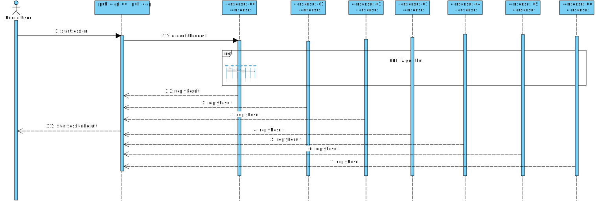

# Start Session Sequence Diagram

## Sequence Diagram

 

In this diagram we show the process of creating a session on the bridge. To
create a session. The bridge user (normally, the UI) will send a request to 
the `public-api` module of the bridge. This is done using a JSON web service.

The public API node will then send a request to the `consensus` module. This 
is done using a gRPC call. Upon receiving the call, the consensus module will
start the PBFT (Practical BFT) consensus process, where the `public-api`
module is acting as a client for the protocol and each `consensus-XX`
node is acting as a replica. After this process is done, and
according to the PBFT protocol, all replicas will return the new session information
to the `public-api` module. The `public-api` module will collect at least `f + 1`
replies from different replicas with the same result, where `f` is the maximum
number of replicas that might fail in the PBFT algorithm. In our example diagram
we have `f = 2`, so we need at least `3` replicas to agree on the result.
Finally, the `public-api` module will then return the session information to the
bridge user.